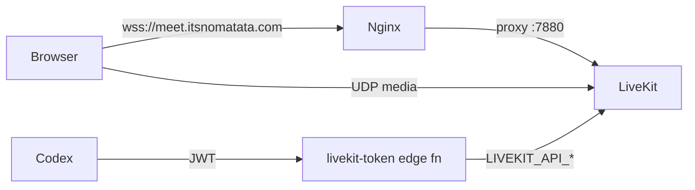

# LiveKit meetings (`meet.itsnomatata.com`)

Codex meetings connect the browser to **LiveKit** at `wss://meet.itsnomatata.com`. Tokens are minted by Supabase Edge Functions (`livekit-token`, `livekit-guest-token`).

## Symptom

> Could not reach the meeting media server at meet.itsnomatata.com …

Usually means **the VPS is not serving HTTPS/WebSocket on 443**, not a bug in the React app.

## Quick diagnosis

```bash
npm run verify:livekit
```

Expected: DNS resolves, HTTPS responds, WebSocket upgrade header present.

As of setup, `meet.itsnomatata.com` → `187.124.113.115`. If verify times out, LiveKit/nginx is down or the firewall blocks inbound traffic.

## Fix on the meet VPS (187.124.113.115)

1. **SSH** into the server whose public IP matches the DNS A record.

2. **Copy** this repo (or `infra/livekit` + `scripts/bootstrap-livekit-vps.sh`) to the server.

3. **Generate API keys** (save output):

   ```bash
   ./scripts/livekit-generate-keys.sh
   ```

4. **Edit** `infra/livekit/livekit.yaml` — under `keys:`, set your key name and secret (one line).

5. **Bootstrap** (on the VPS as root):

   ```bash
   sudo bash scripts/bootstrap-livekit-vps.sh
   ```

6. **Supabase** → Project → Edge Functions → Secrets (must match `livekit.yaml`):

   | Secret | Value |
   |--------|--------|
   | `LIVEKIT_URL` | `wss://meet.itsnomatata.com` |
   | `LIVEKIT_API_KEY` | Key from `generate-keys` |
   | `LIVEKIT_API_SECRET` | Secret from `generate-keys` |

7. **Redeploy** edge functions:

   ```bash
   npm run deploy:livekit-functions
   ```

8. **Vercel** (optional, same URL as Supabase):

   ```
   VITE_LIVEKIT_URL=wss://meet.itsnomatata.com
   ```

9. Re-run `npm run verify:livekit`, then join a meeting in Codex.

## Firewall (Hostinger / cloud panel + UFW)

| Port | Protocol | Purpose |
|------|----------|---------|
| 80 | TCP | Let's Encrypt HTTP challenge |
| 443 | TCP | HTTPS / WSS / TURN-TLS |
| 3478 | UDP | TURN |
| 7881 | TCP | WebRTC TCP fallback |
| 50000–50100 | UDP | Media (RTC port range in `livekit.yaml`) |

## Architecture



## Files in this repo

- `infra/livekit/livekit.yaml` — server config
- `infra/livekit/docker-compose.yml` — LiveKit + Redis (host network)
- `infra/livekit/nginx/meet.itsnomatata.com.conf` — TLS + WebSocket proxy
- `scripts/bootstrap-livekit-vps.sh` — one-shot VPS installer
- `scripts/verify-livekit-server.mjs` — connectivity check

## Note on n8n VPS

`n8n.srv883957.hstgr.cloud` uses a **different** IP (`31.97.158.191`). Do not point `meet.itsnomatata.com` there unless you intentionally host LiveKit on that machine and open the same ports.
