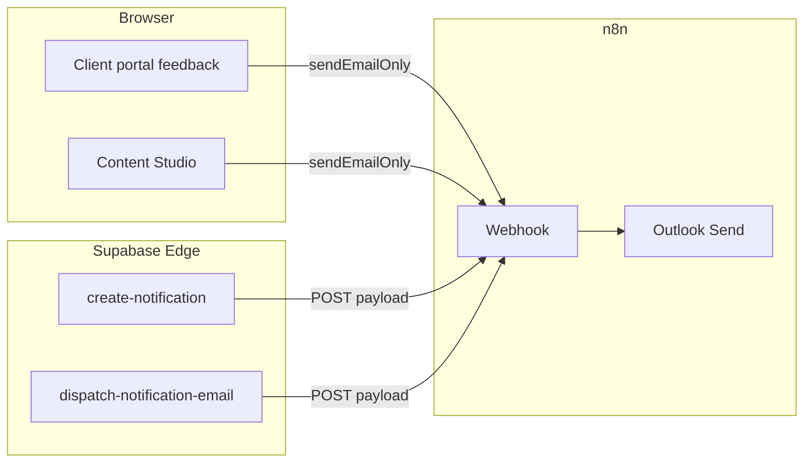

# Notification email via n8n (Content Studio + Codex)

Sends workspace notification emails through n8n → **Microsoft Outlook** (same pattern as WhatsApp escalation and EziTrack import).

Covers:

- **Content review** client/internal feedback (`sendContentReviewFeedbackEmails` from the portal and studio)
- **In-app notifications** with the email channel (`create-notification` edge function)
- **Queued retries** every 2 minutes if a delivery was left in `queued` status

---

## 1. Import the workflow

1. In n8n: **Workflows → Import from file**
2. Choose `n8n/itsnomatata-notification-email.workflow.json`
3. Open **04 Outlook — Send Email** and attach your **Microsoft Outlook** credential (e.g. `codex@itsnomatata.com`, same as WhatsApp workflow).
4. Replace `REPLACE_WITH_CODEX_OUTLOOK_CREDENTIAL_ID` in the JSON before import, or re-select credentials after import.

---

## 2. n8n Variables (required on this host)

| Variable | Example / purpose |
|----------|-------------------|
| `NOTIFICATION_WEBHOOK_SECRET` | Same value as app `VITE_N8N_NOTIFICATION_WEBHOOK_SECRET` |
| `SUPABASE_URL` | `https://zirftywinscopzuuwdlg.supabase.co` |
| `SUPABASE_SERVICE_ROLE_KEY` | Service role (queue backup node only) |

---

## 3. Activate webhook

1. Open the imported workflow.
2. Open **01 Webhook — Notification Email** and copy the **Production URL**  
   Path: `itsnomatata-notification-email`  
   Full URL shape:  
   `https://n8n.srv883957.hstgr.cloud/webhook/itsnomatata-notification-email`
3. **Activate** the workflow.

---

## 4. App & Supabase secrets

### Local `.env` (Vite — browser emails e.g. client portal feedback)

```env
VITE_N8N_NOTIFICATION_WEBHOOK_URL=https://n8n.srv883957.hstgr.cloud/webhook/itsnomatata-notification-email
VITE_N8N_NOTIFICATION_WEBHOOK_SECRET=your-long-random-secret
```

Restart `npm run dev` after changing `.env`.

### Supabase Edge Function secrets (server-side queue + `create-notification`)

In **Supabase Dashboard → Edge Functions → Secrets** (or CLI):

```bash
supabase secrets set N8N_NOTIFICATION_WEBHOOK_URL=https://n8n.srv883957.hstgr.cloud/webhook/itsnomatata-notification-email
supabase secrets set N8N_NOTIFICATION_WEBHOOK_SECRET=your-long-random-secret
```

Deploy functions:

```bash
supabase functions deploy create-notification
supabase functions deploy dispatch-notification-email
```

`N8N_NOTIFICATION_WEBHOOK_SECRET` must match `NOTIFICATION_WEBHOOK_SECRET` in n8n Variables and `VITE_N8N_NOTIFICATION_WEBHOOK_SECRET` in `.env`.

---

## 5. How traffic flows



| Source | Path |
|--------|------|
| Client approves / requests changes | `ClientPortalReviewPage` → `sendContentReviewFeedbackEmails` → `sendEmailOnly` → n8n webhook |
| Internal comments in studio | `contentReviewService` → `sendEmailOnly` → n8n webhook |
| Any `create-notification` with email channel | Edge function builds HTML → n8n webhook → updates `notification_deliveries` |
| Stuck `queued` rows | n8n **Schedule** every 2 min → `dispatch-notification-email` → n8n webhook |

---

## 6. Test

### A. Direct webhook (n8n test execution)

Send from terminal (replace URL and secret):

```bash
curl -sS -X POST 'https://n8n.srv883957.hstgr.cloud/webhook/itsnomatata-notification-email' \
  -H 'Content-Type: application/json' \
  -H 'x-notification-secret: YOUR_SECRET' \
  -d '{
    "to": "you@itsnomatata.com",
    "fullName": "Test User",
    "title": "[Client review] Approval (Post 1) — June 2026 schedule",
    "message": "Michelle approved Post 1 in \"June 2026 schedule\".",
    "type": "system_alert",
    "priority": "high",
    "actionUrl": "/admin/content-studio/editor/DRAFT_UUID",
    "metadata": {
      "feedback_source": "client",
      "source_badge": "Client review",
      "review_event": "approval_note"
    },
    "subject": "[Client review] Approval (Post 1) — June 2026 schedule - Nomatata",
    "emailHtml": "<p>Hi Test,</p><p>Client approved a post.</p>"
  }'
```

Expect `{"ok":true,"sent":true,...}` and an inbox message from your Outlook sender.

### B. Content review (end-to-end)

1. Set `.env` webhook URL + secret and restart dev server.
2. In client portal, approve one post on a **sent** schedule.
3. Check browser Network tab: POST to n8n webhook returns 200.
4. Content team inbox receives email with **Client review** badge.

### C. Queue backup

```bash
curl -sS -X POST 'https://zirftywinscopzuuwdlg.supabase.co/functions/v1/dispatch-notification-email' \
  -H "Authorization: Bearer SERVICE_ROLE_KEY" \
  -H "apikey: SERVICE_ROLE_KEY" \
  -H "Content-Type: application/json" \
  -d '{"limit":10}'
```

---

## 7. Troubleshooting

| Symptom | Fix |
|---------|-----|
| Console: `VITE_N8N_NOTIFICATION_WEBHOOK_URL is not set` | Add vars to `.env` and restart Vite |
| Webhook 401 | Align secret across n8n Variable, `.env`, and Supabase secrets |
| Webhook 404 | Workflow not **Active** or wrong production URL |
| In-app notification but no email | Set `N8N_NOTIFICATION_WEBHOOK_URL` on Supabase and redeploy `create-notification` |
| `notification_deliveries` stuck `queued` | Activate workflow (schedule node) or call `dispatch-notification-email` manually |
| Outlook node fails | Re-auth Microsoft credential; confirm sender can send externally |

---

## 8. IT Dashboard check

**IT Dashboard → Automations / n8n** shows whether `VITE_N8N_NOTIFICATION_WEBHOOK_URL` is set in the frontend build. Server-side config is reported by the `system-health` edge function (`n8nNotificationConfigured`).
